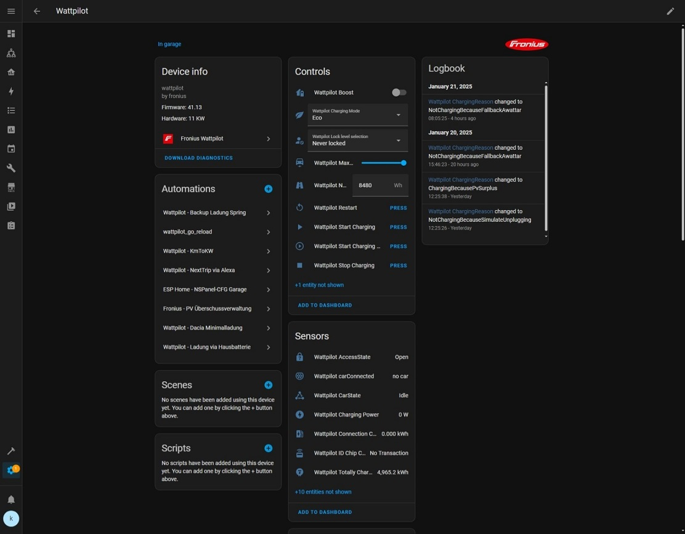
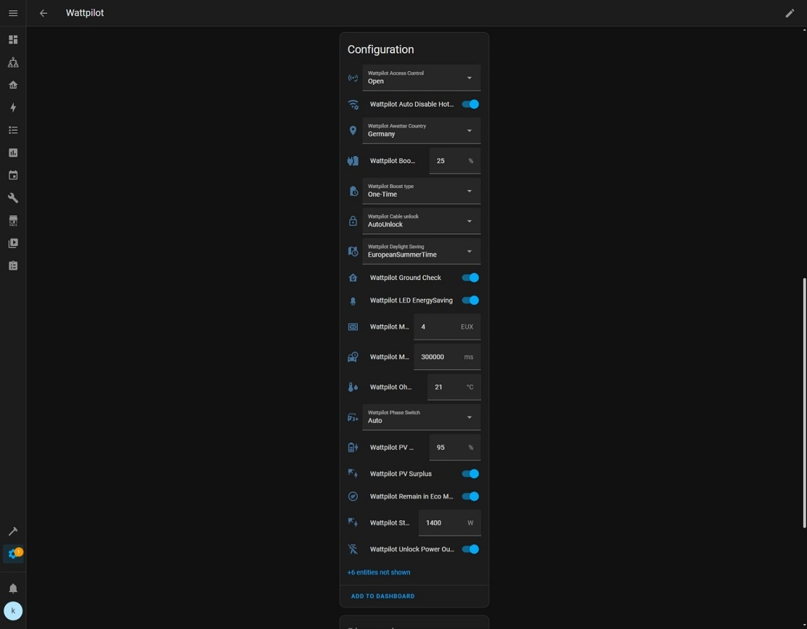
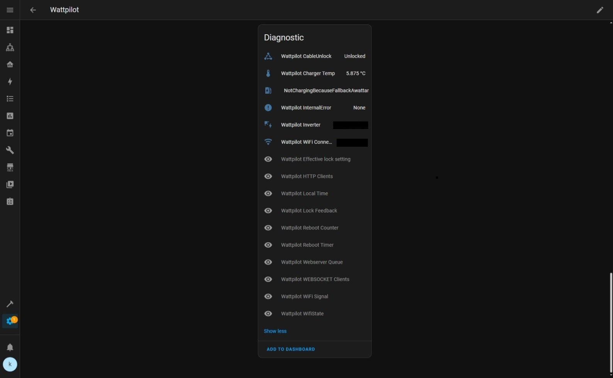
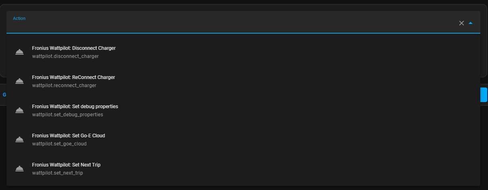
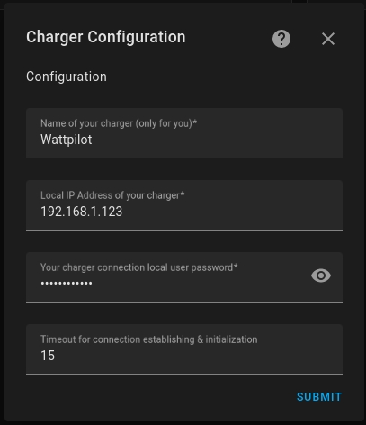

> **Note:** This repository is a fork/downstream copy of the upstream project
> [mk-maddin/wattpilot-HA](https://github.com/mk-maddin/wattpilot-HA) by Martin Kraemer
> ([@mk-maddin](https://github.com/mk-maddin)), which is the original source and the place to
> get official releases, report issues, and support the author. All credit for the integration
> belongs upstream; it is redistributed here under its original
> [Apache-2.0](LICENSE) license. For official releases, issues, and support, go to the
> upstream project — the badges above track this fork.

# What This Is:

This is a custom component to allow control of [Fronius Wattpilot](https://www.fronius.com/en/solar-energy/installers-partners/technical-data/all-products/solutions/fronius-wattpilot/fronius-wattpilot/wattpilot-home-11-j) wallbox/electro vehicle charging devices in [Homeassistant](https://home-assistant.io) using the unofficial/reverese enginered [wattpilot python module](https://github.com/joscha82/wattpilot).

WARNING:
This is a work in progress project - it is still in early development stage, so there are still breaking changes possible.

## Disclaimer:

As written this is an unofficial implementation.
Currently there does not seem to be an official API available by fronius, so this is all based on the work of volunteers and hobby programmers.
It might stop working at any point in time.

You are using this module (and it's prerequisites/dependencies) at your own risk.
Not me neither any of contributors to this or any prerequired/dependency project are responsible for damage in any kind caused by this project or any of its prerequsites/dependencies.

# What It Does:

Allows for control of [Fronius Wattpilot](https://www.fronius.com/en/solar-energy/installers-partners/products-solutions/residential-energy-solutions/e-mobility-and-photovoltaic-residential/wattpilot-ev-charging-solution-for-homes) wallbox/electro vehicle charging devices via home assistant with the following features:

* works with wattpilot, wattpilot V2 & wattpilot flex
* connect charger via local LAN or via Cloud
* charging mode change
* start / stop charging
* configuration for different charging behaviours
* sensors for charging box status
* manual disconnect/reconnect chargers (Helpful for Wattpilot GO version)
* next trip timing configuration via service call (& event when next trip timing value is changed) -> you can create an [input_datetime (example)](packages/wattpilot/wattpilot_input_datetime.yaml) entity & corresponding [automation (example)](packages/wattpilot/wattpilot_automation.yaml) which ensures the input_datetime is in sync with the setting wihtin your wattpilot charger
* log value changes for properties of the wallbox as warnings (enable/disable via service call)
* can enable/disable e-go cloud charging API (enable/disable via service call) -> this is at your own responsibility - is not clear if fronius/you "pay" in some way for the e-go cloud API and thus are legally allowed to use -> as it is not required at the moment for the functionality of this component, I do not recommend to enable

## Open Topics:

* create a light integration for LED color control etc.
* evaluate entity unique ID generation using WP serial number

## Known Errors:

* No explicit known errors
* See https://github.com/mk-maddin/wattpilot-HA/issues for issues.

# Screenshots

### Example Device (additional sensors + buttons can be enabled)

### Next Trip via timing via Service Call

# Installation and Configuration

## Installation

### Install with HACS

Do you you have [HACS](https://community.home-assistant.io/t/custom-component-hacs) installed?
You can manually add this repository to your HACS installation. [Here is the manual process](https://hacs.xyz/docs/faq/custom_repositories/).
Then search for "Wattpilot" and install it directy from HACS.
HACS will keep track of updates and you can easily upgrade to latest version. See Configuration for how to add it in HA.

### Install manually
Download the repository and save the "wattpilot" folder into your home assistant custom_components directory.

Once the files are downloaded, you’ll need to **restart HomeAssistant** and wait some minutes (probably clear your browser cache),
for the integration to appear within the integration store.

## Configuration

### Using MyHA:

[MyHA - Add Integration](https://my.home-assistant.io/redirect/config_flow_start?domain=wattpilot)

### Manually:

1. Browse to your Home Assistant instance.
2. In the sidebar click on Configuration.
3. From the configuration menu select: Integrations.
4. In the bottom right, click on the Add Integration button.
5. From the list, search and select "Fronius Wattpilot".
6. Follow the instruction on screen to complete the set up.
   (If connecting local/LAN you will require the local IP - for cloud connection your wattpilot serial is required)

# Credits:

Big thank you go to [@joscha82](https://github.com/joscha82).
Without his greate prework in the [wattpilot python module](https://github.com/joscha82/wattpilot) it would be not possible to create this.

# License

[Apache-2.0](LICENSE). By providing a contribution, you agree the contribution is licensed under Apache-2.0. This is required for Home Assistant contributions.
